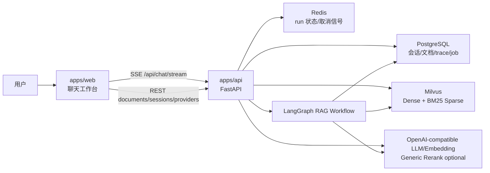
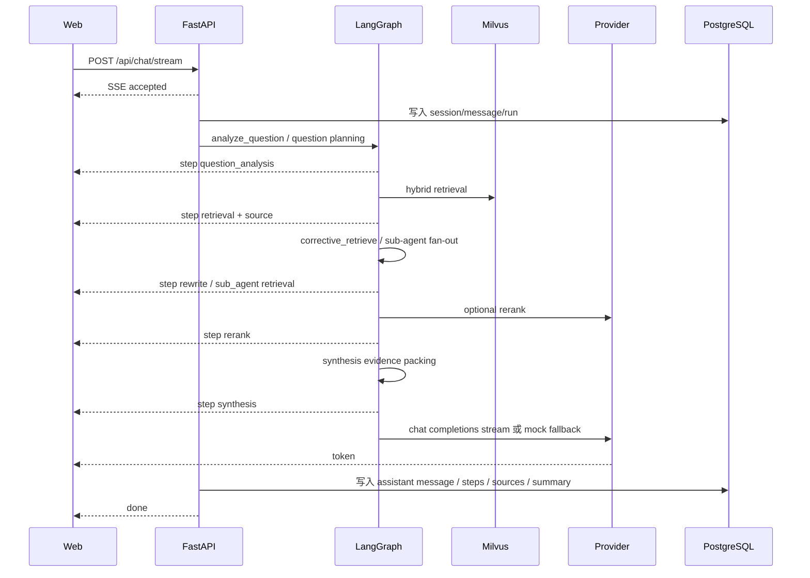

# ARCHITECTURE.md

## 总览

`nebulai bot` 是一个私有知识库 RAG 问答工作台。当前实现采用 pnpm monorepo：

- `apps/web`：TanStack Start + React + TypeScript + Tailwind CSS + assistant-ui runtime。
- `apps/api`：FastAPI + LangGraph RAG workflow + SSE。
- `packages/shared`：前后端共享 TypeScript 类型。
- `infra/milvus`：Milvus collection 说明。



## 前端

核心路径：`apps/web/src`

- `components/chat-shell.tsx`：主工作台，会话、消息、停止生成、右侧面板协调。
- `components/message-list.tsx`：消息流展示。
- `components/composer.tsx`：assistant-ui composer 输入区。
- `components/rag-timeline.tsx`：RAG trace 和来源展示。
- `components/document-panel.tsx`：文档上传、processing 轮询、删除、重试索引。
- `components/provider-panel.tsx`：provider 配置状态和 live verify。
- `lib/chat-stream.ts`：消费后端 SSE。
- `lib/chat-history.ts`：会话、消息和历史 trace API。
- `lib/documents.ts`：知识库文档和 ingestion jobs API。
- `lib/providers.ts`：provider status API。

前端运行原则：

- SSE token 实时追加。
- 停止生成先调用后端 cancel，再 abort 本地 stream。
- 后端不可用时保留本地新会话 fallback。
- 页面恢复时从 PostgreSQL 会话 API 拉取消息和最近一次 RAG trace。

## 后端

核心路径：`apps/api/src/nebulai`

- `api/chat.py`：聊天、会话、run trace、取消接口。
- `api/documents.py`：上传、列表、状态、删除、重试索引、job 查询。
- `api/providers.py`：provider 配置状态和 live verify。
- `rag/graph.py`：LangGraph RAG 主流程；LangGraph 不可用时复用同一套节点函数顺序执行。
- `rag/planning.py`：问题复杂度分类、子问题拆解和可选 LLM question planner。
- `rag/retrieval.py`：Milvus hybrid 检索、dense fallback 和失败可观测边界。
- `rag/corrective.py`：相关性评分、rewrite 策略和并行二次检索。
- `rag/rerank.py`：通用 rerank provider、旧 Jina 配置兼容与 fallback。
- `rag/synthesis.py`：证据去重、引用顺序绑定和无证据策略。
- `rag/answer.py`：OpenAI-compatible LLM streaming 与 mock fallback。
- `rag/embeddings.py`：OpenAI-compatible embeddings 与 mock-hash fallback。
- `rag/ingestion.py`：文档解析、清洗、三级分块、向量写入。
- `rag/ingestion_queue.py`：PostgreSQL 持久化 ingestion/vector retry 队列。
- `rag/memory.py`：会话摘要记忆。
- `stores/postgres.py`：持久化会话、消息、文档、chunks、runs、steps、sources、jobs。
- `stores/redis.py`：run 状态和取消信号，Redis 异常时降级内存。
- `stores/milvus.py`：collection 创建、L3 leaf chunk upsert、文档向量删除。

## 问答流程



当前 LangGraph 节点：

```text
analyze_question -> retrieve_context -> corrective_retrieve -> rerank_context -> plan_answer
```

`build_langgraph_app()` 会缓存已编译 graph，避免每次请求重复构建。direct fallback 只负责在 LangGraph 包不可用时顺序调度相同节点函数，不再维护第二套 RAG 业务逻辑。

当 `show_steps=true` 时，后端会创建 workflow `event_queue`。LangGraph 节点执行期间直接写入 step 事件，SSE 生成器一边等待 workflow task，一边消费 queue，因此前端不必等完整 workflow 结束后才看到检索、拆解、rerank 和 synthesis 过程。

复杂问题会先经过 question planner。无 LLM key 时使用 deterministic planner；配置 OpenAI-compatible LLM 后可用 JSON planner 产出 `simple/multi_hop/comparison/broad_summary` 和 2-4 个子问题。LangGraph 通过 conditional `Send("sub_agent_retrieve", ...)` 原生 fan-out 到 sub-agent 节点；每个 sub-agent 会执行 `retrieve -> corrective assess -> optional secondary retrieval -> rerank`，结果再 fan-in 回主链路合并。LangGraph 包不可用时，direct fallback 使用同一套子链路本地并行执行。

## 知识库流程

1. `POST /api/documents` 保存文件 metadata 和 blob。
2. 创建 `ingestion_jobs`，接口先返回 `processing`。
3. API 内 worker claim job，解析 txt/md/docx/pdf/csv/xlsx。
4. 生成 L1/L2/L3 chunks，并写入 PostgreSQL 父子关系。
5. 仅 L3 leaf chunks 写入 Milvus。
6. Milvus collection 使用 `dense_vector` + `text` BM25 Function 生成 `sparse_vector`。
7. 前端 Knowledge 面板轮询文档状态和 job 进度。

PostgreSQL 不可用时，上传路径会退回进程内 fallback；Milvus 不可用时，文档仍保留 chunk/metadata，并记录 vector degraded/skipped 原因。问答检索中，Hybrid 和 Dense 都失败时返回空来源和 `retrieval_failed` trace，不再伪造 mock source。

检索命中 L3 后会回溯父块。单个 leaf 命中优先使用 L2 上下文；多个 L2 命中同一 L1 时自动提升到 L1 上下文，作为基础 Auto-merging 策略。

当前文档解析边界：

- TXT/Markdown/CSV 使用文本解析，其中 CSV 会保留表头、行号和列名。
- XLSX 直接解析 Office Open XML workbook、shared strings 和 worksheet 行列，保留 sheet 名、表头、行号和列名；旧版二进制 `.xls` 暂不支持。
- DOCX 解析正文段落、表格、页眉、页脚、脚注、尾注和批注，并把表格转为可检索的 `表头/第N行/列名=值` 文本。
- PDF 优先使用 `pdfplumber` 提取 layout 文本和表格，依赖缺失或失败时回退 `pypdf` 文本提取；扫描件/OCR 仍属于后续增强边界。

## Provider 配置边界

本项目的真实外部调用分三类：

- LLM：`LLM_PROVIDER=openai-compatible` 后调用 `{LLM_BASE_URL}/chat/completions`。
- Embedding：`EMBEDDING_PROVIDER=openai-compatible` 后调用 `{EMBEDDING_BASE_URL}/embeddings`；`EMBEDDING_SEND_DIMENSIONS=false` 时不发送 `dimensions` 字段，用于适配 SiliconFlow `BAAI/bge-m3` 等固定维度模型。
- Rerank：优先使用通用 `RERANK_*`，兼容旧 `JINA_*`；缺 key 时保留 Milvus RRF 顺序。

Key 优先级：

- LLM 使用 `LLM_API_KEY || OPENAI_API_KEY || SILICONFLOW_API_KEY`。
- Embedding 使用 `EMBEDDING_API_KEY || OPENAI_API_KEY || SILICONFLOW_API_KEY`。
- Rerank 使用 `RERANK_API_KEY || JINA_API_KEY || SILICONFLOW_API_KEY`。

缺 key 或 provider 调用失败不会阻断主链路：

- LLM 失败：输出 warning，回退 mock token stream。
- Embedding 失败：回退 mock-hash embedding，并在文档 metadata 中记录 degraded。
- Rerank 失败：保留 Milvus RRF 顺序，并在 trace 中记录 warning。
- Summary 失败：回退 deterministic 会话摘要，不影响消息保存。

当前 `.env` 已配置硅基流动 LLM、`BAAI/bge-m3` embedding 和 `BAAI/bge-reranker-v2-m3` rerank。`BAAI/bge-m3` 为 1024 维，旧 384 维 Milvus collection 需要重建后重新 ingestion。具体配置见 `README.md` 和 `docs/PROVIDER_SMOKE.md`。

## 数据模型

PostgreSQL 关键表：

- `sessions`、`messages`
- `documents`、`document_blobs`、`chunks`
- `ingestion_jobs`
- `rag_runs`、`rag_steps`、`rag_sources`

Milvus collection：

- 名称：`nebulai_chunks`
- 仅存 L3 leaf chunks。
- `dense_vector` 维度来自 `EMBEDDING_DIMENSION`，默认 `384`。
- `text` 启用 analyzer，并通过 BM25 Function 写入 `sparse_vector`。

Redis：

- run 注册、取消信号、完成状态。
- Redis 失败时降级到进程内 run control。

## 当前缺口

- Synthesis 已有基础证据整理节点，后续仍需补冲突检测、句级引用校验和 prompt budget packing。
- 多实例部署前需要独立 worker、job lease timeout、dead-letter queue。
- 真实 provider live smoke 取决于用户提供 key、模型和 endpoint。
